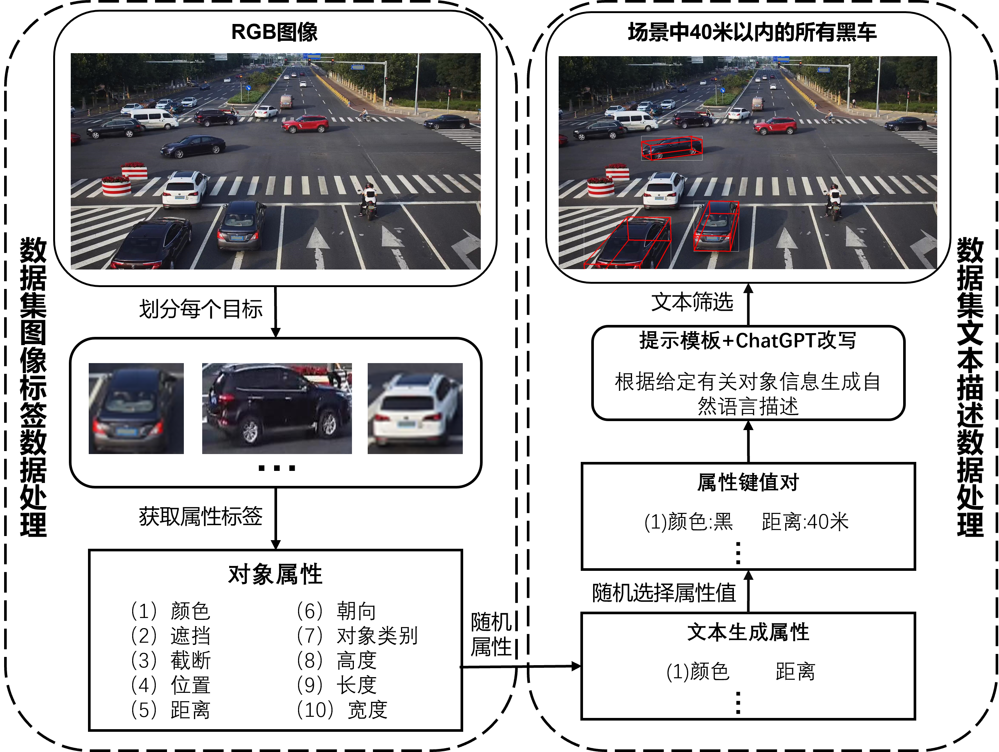
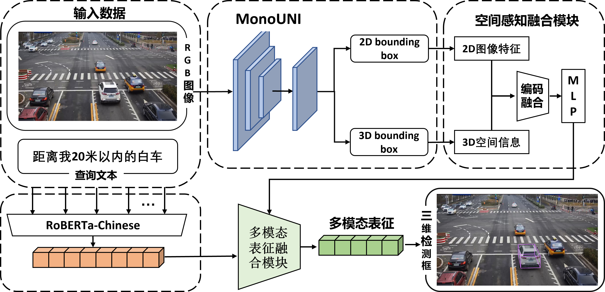

# Traffic3DVG

### This is the official repository for paper **"A Benchmark Study of Multi-Objective 3D Visual Grounding for Monocular RGB Image"**

##  Dataset
Download our Traffic3DRefer dataset, which can be downloaded from our [One Drive](https://1drv.ms/u/c/3310bf5644a9cadb/EcPSFWnmL7pNt8tBQrXGLFYB3vBPUGoWrDhuUCB5ED5jnA?e=0xfXhn). The download link is available below:
```
https://1drv.ms/u/c/3310bf5644a9cadb/EcPSFWnmL7pNt8tBQrXGLFYB3vBPUGoWrDhuUCB5ED5jnA?e=0xfXhn
```

<div align="center">
  
</div>

##  Traffic3DVG: Framework

<div align="center">
  
</div>

## 👁️ Visualization

### Visualization analysis from our Traffic3DVG.

<div align="center">
  
</div>


### A detailed README and checkpoints will be released later.
